# **Recommendations-for-Food**

In this group project, our goal is to recommend food for different users by predicting ratings for food recipes based on the rating history of each users. We used the dataset from Kaggle: [Project Dataset: foodrecsysv1](https://www.kaggle.com/elisaxxygao/foodrecsysv1).

During the process, we cleaned and manipulated the data, identified the most important variables, came up with our own features, and build the prediction model using KNN. We also applied GridSearch in order to get the optimal combination for our model with the highest prediction accuracy.

The one of the unique features about our model is it can change throughout time. **The model itself is not fixed.** People's preferences may change, so should the prediction models.

## Code
Please see the [Jupyter Notebook](https://yiting2018.github.io/Recipe_rating_prediction.html) for details.

### [Go Back to Homepage](https://yiting2018.github.io)

## Slides
#### [Download PDF](https://github.com/Yiting2018/Recommendations-for-Food/raw/master/documents/Recipes_Rating_System.pdf)

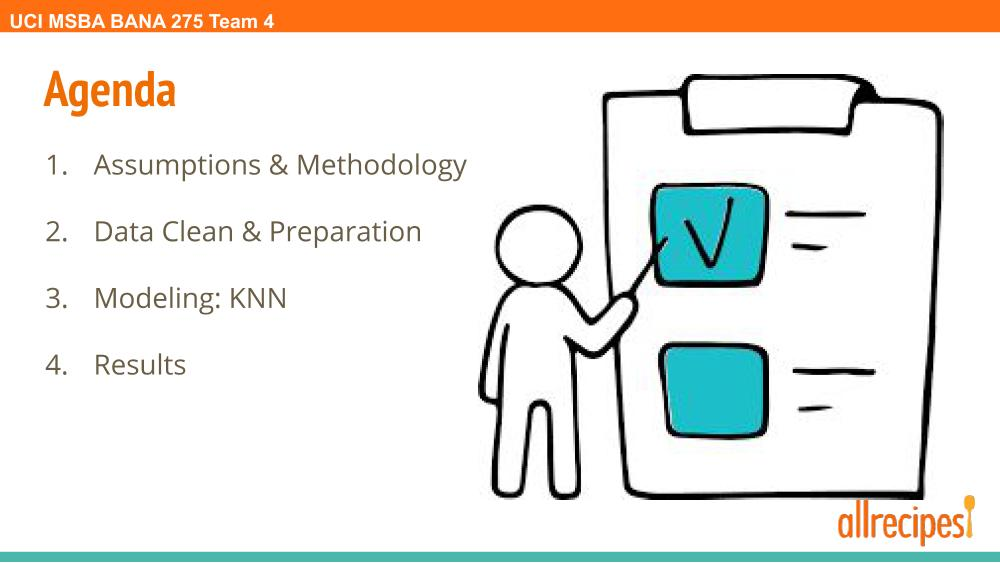
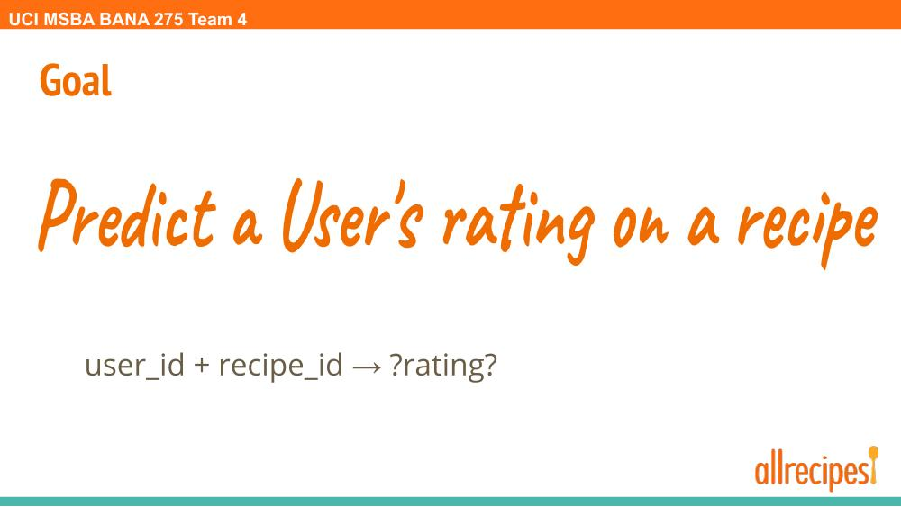
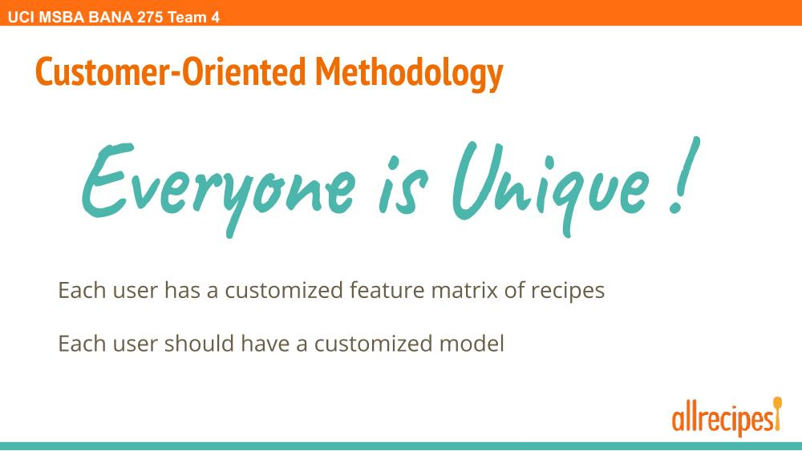
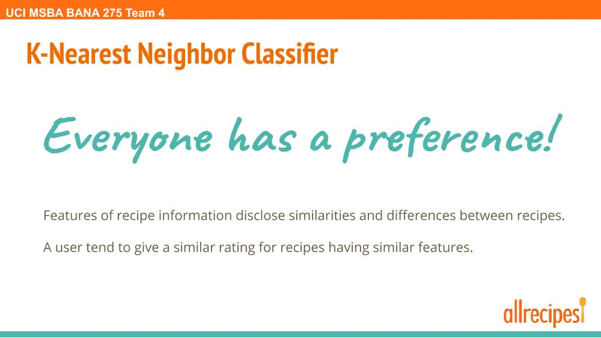
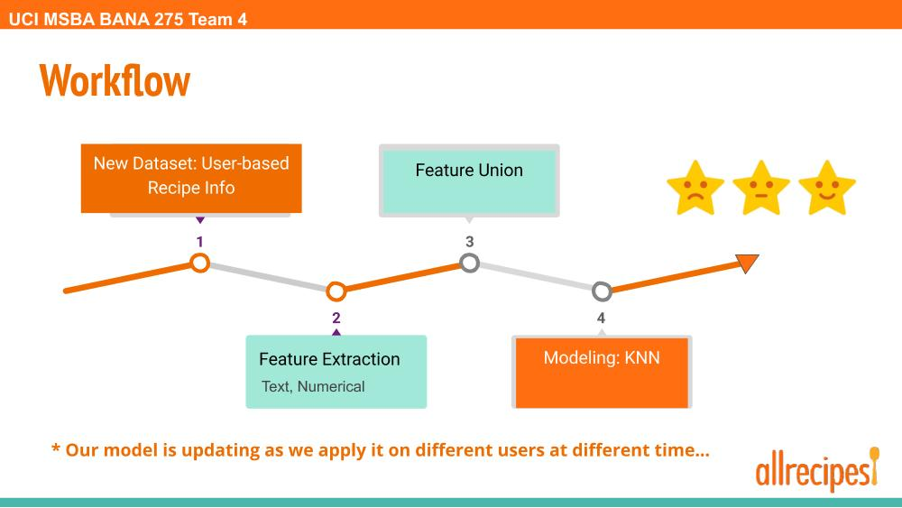
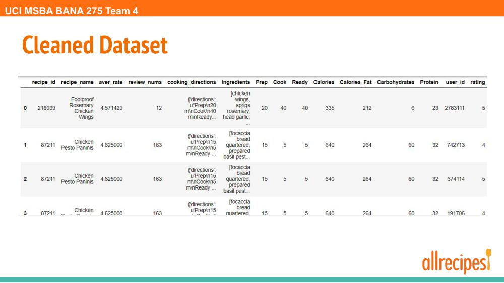
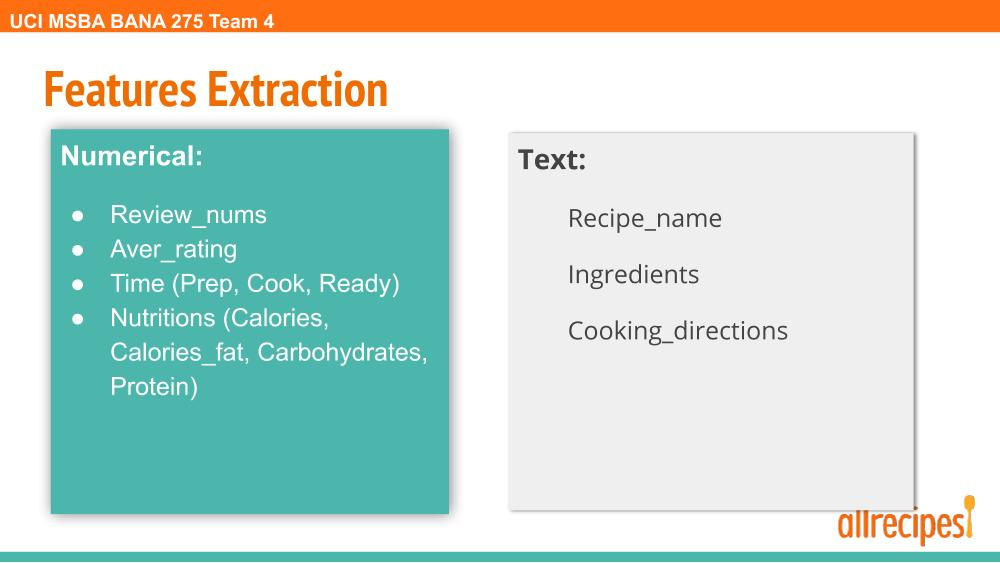
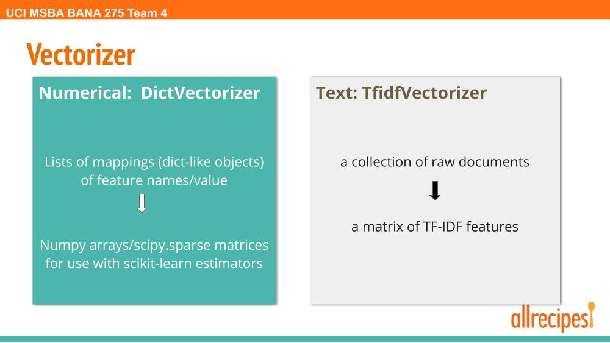
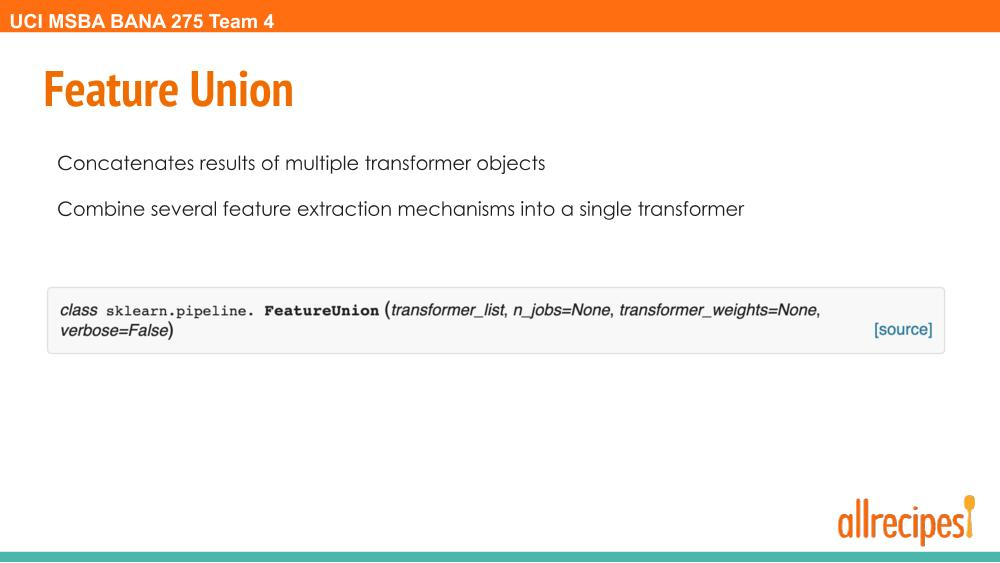
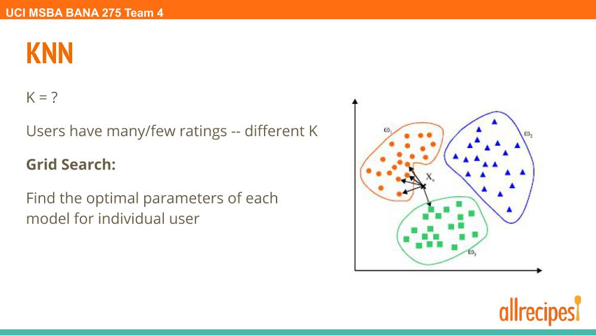
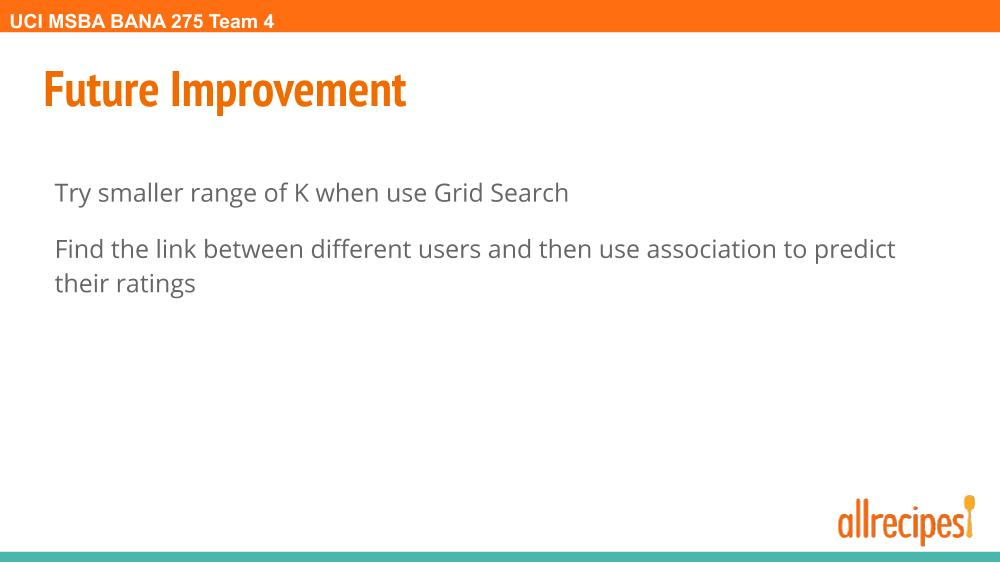
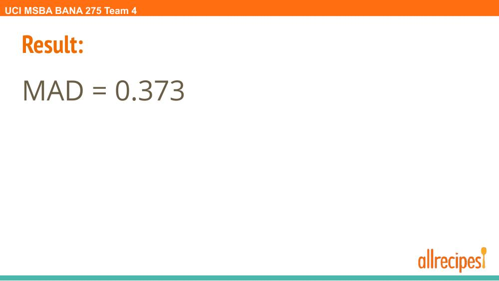
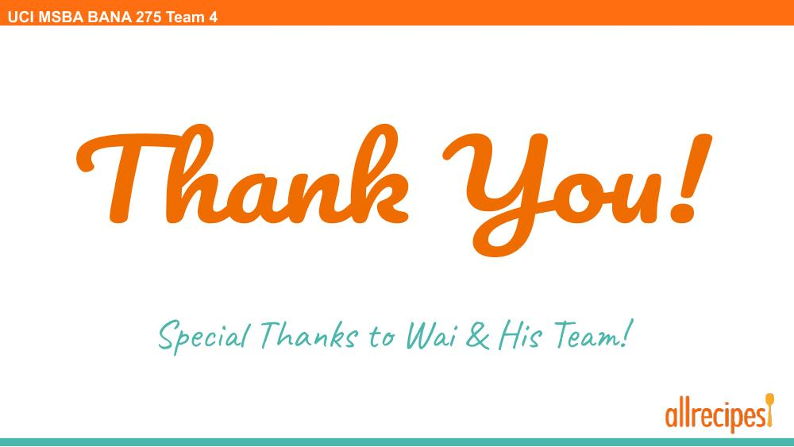

### [Go Back to Homepage](https://yiting2018.github.io)
